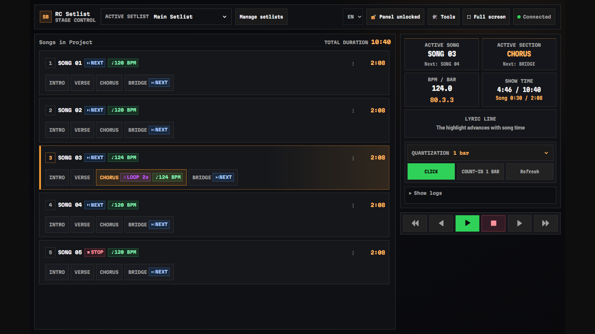

# RC Setlist

[](LICENSE)
[](CHANGELOG.md)
[](https://github.com/ntworm/rc-setlist/actions/workflows/ci.yml)

**English** · [Português (Brasil)](README.pt-BR.md)

> **[Landing page and screenshots](https://ntworm.github.io/rc-setlist/)**
>
> 

RC Setlist is a source-available setlist extension for Ableton Live. It turns
Arrangement locators into an operator setlist, synchronized lyrics, tempo and
click feedback, and guarded transport controls for rehearsals and live shows.

[Landing page](https://ntworm.github.io/rc-setlist/) ·
[Installation](docs/INSTALL.md) ·
[User guide](docs/USER-GUIDE.md) ·
[Português (Brasil)](README.pt-BR.md) ·
[Latest release](https://github.com/ntworm/rc-setlist/releases/latest)

> **Network safety:** RC Setlist serves browser controls on your local network.
> Use it only on a trusted LAN, keep the controller URL/token private, and never
> expose port `4444` directly to the public internet. See [SECURITY.md](SECURITY.md).

## Highlights

- Locator-driven songs and sections with `[loop]`, `[loop Nx]`, `[stop]`,
  `[next]`, `[bpm N]`, `[click]`, `[click off]`, `[skip]` and `[hidden]` tags.
- Setlist and performance views for desktop, notebook, tablet and phone.
- Synchronized `.lrc` lyrics plus an in-browser timing and editing workflow.
- Guarded transport, quantization feedback and counted-loop handling.
- Per-profile ordering, lyrics and CSV export stored locally.
- Multiple saved setlists scoped to the current Ableton Live Set, with
  recoverable delete/restore.
- Song durations and total setlist duration calculated from the Arrangement.
- Fullscreen stage mode with Screen Wake Lock when the browser supports it.
- English and Brazilian Portuguese interfaces in the same `.ablx`.
- No account, cloud sync, analytics or telemetry.
- Keyboard Mapping for assigning transport and view actions to Numpad or alpha keys.

## Requirements

- Ableton Live 12.4.5+ Suite (Beta) with Extensions support.
- RC Bridge, the bundled Remote Script (a fork of
  [AbletonOSC](https://github.com/ideoforms/AbletonOSC)), selected as a Live
  Control Surface for transport and Live Object Model operations.
- Node.js 24.16.0 or newer in the Node 24 LTS line only when developing from
  source. End users install the `.ablx` and do not need Node.js.

Windows is the validated release platform. macOS support remains experimental
until this release is exercised on real macOS hardware.

## Quick start

1. Install RC Bridge: run the kit's `Install-RC-Bridge.cmd` / `Install RC Bridge.command`, then choose RCBridge as a Control Surface in Live.
2. Download `RC-Setlist-1.0.0.ablx` from the latest release.
3. Open the `.ablx` and approve installation in Live.
4. In Live, open **Extensions > RC Setlist** and start the server.
5. Use the panel URL or QR code to open `/setlist` or `/performance`.
6. Choose English or **Português (Brasil)** from the language menu.

Users upgrading from 0.x (`Ableton-RC-Setlist-0.4.x`–`0.7.0`) run the kit's
`Migrate-RC-Setlist-Data.cmd` (Windows) or `Migrate RC Setlist Data.command`
(macOS) once before opening Live with 1.0. The script copies profiles,
project-setlists and preferences into the new layout without touching the old
one. The browser may show a warning for the per-install self-signed
certificate. Accept it only when the address matches the host shown by RC
Setlist on your trusted local network. Full instructions are in
[docs/INSTALL.md](docs/INSTALL.md).

## Locator format

```text
Neon Signal [bpm 122] [click]
Neon Signal > Intro
Neon Signal > Chorus [loop 2x]
Neon Signal > Outro [stop]
```

All examples in this repository are fictional. See [examples/README.md](examples/README.md)
for a complete demonstration set.

## Architecture

```text
Ableton Live + RC Bridge (bundled fork of AbletonOSC)
          │ OSC 11020, replies to the asking socket
          │ (stock AbletonOSC on 11000/11001 still accepted)
          ▼
     RC Setlist extension
          │ local HTTP(S) + WebSocket :4444
          ├── /setlist       operator workspace
          └── /performance   stage display
```

The extension is local-first. The SDK-facing files sit at the edge; parser,
state, transport policy, persistence and browser clients are testable through
the public dependency gate.

## Development

```bash
npm ci
npm run ci:public
```

The Ableton SDK and CLI are not redistributed in this source repository.
Authorized developers can configure a complete build using
[vendor/README.md](vendor/README.md) and [docs/DEVELOPMENT.md](docs/DEVELOPMENT.md).

## Documentation

- [Documentation index](docs/README.md)
- [What is new in 1.0.0](docs/RELEASE-NOTES-1.0.0.md)
- [Notas da versão 1.0.0 (pt-BR)](docs/pt-BR/NOTAS-DA-VERSAO-1.0.0.md)
- [Installation](docs/INSTALL.md)
- [User guide](docs/USER-GUIDE.md)
- [Português (Brasil)](docs/pt-BR/README.md)
- [Troubleshooting](docs/TROUBLESHOOTING.md)
- [Tester guide](docs/TESTER-GUIDE.md)
- [Development](docs/DEVELOPMENT.md)
- [Contracts](docs/CONTRACTS.md)
- [Privacy](PRIVACY.md)
- [Security](SECURITY.md)
- [Support](SUPPORT.md)
- [Contributing](CONTRIBUTING.md)
- [Third-party notices](THIRD_PARTY_NOTICES.md)

## License

RC Setlist is source-available under the
[PolyForm Noncommercial License 1.0.0](LICENSE). Noncommercial use,
modification and redistribution are permitted under its terms; commercial use
is not permitted. This is not an OSI-approved open-source license.

Required Notice: Copyright © 2026 Gabriel Worm<br>
<https://github.com/ntworm/rc-setlist>

Ableton and Ableton Live are trademarks of Ableton AG. RC Setlist is an
independent project and is not affiliated with or endorsed by Ableton AG.
