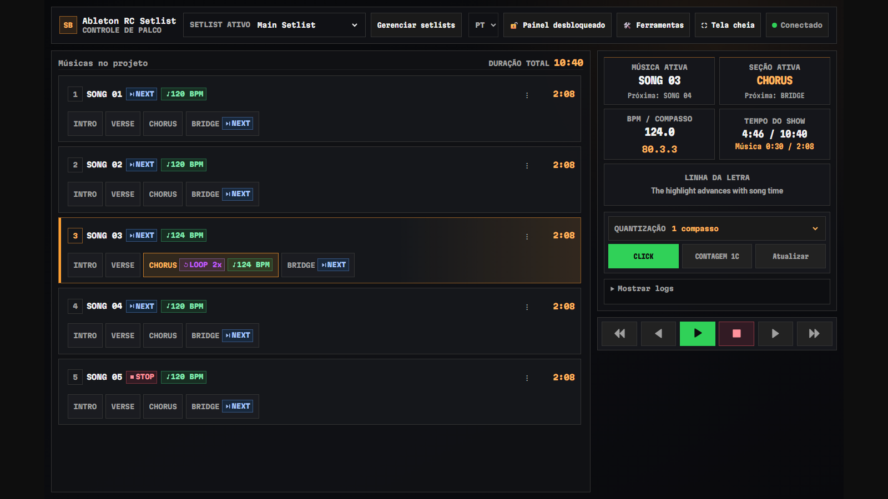

# RC Setlist

[](LICENSE)
[](CHANGELOG.md)
[](https://github.com/ntworm/rc-setlist/actions/workflows/ci.yml)

[English](README.md) · **Português (Brasil)**

> **[Landing page e capturas de tela](https://ntworm.github.io/rc-setlist/)**
>
> 

RC Setlist é uma extensão de setlist com código disponível (source-available) para Ableton Live. Ela transforma localizadores do Arrangement em um setlist para o operador, letras sincronizadas, feedback de tempo e metrônomo, e controles de transporte protegidos para ensaios e apresentações ao vivo.

[Landing page](https://ntworm.github.io/rc-setlist/) ·
[Instalação](docs/pt-BR/INSTALL.md) ·
[Guia do usuário](docs/pt-BR/USER-GUIDE.md) ·
[English](README.md) ·
[Última versão](https://github.com/ntworm/rc-setlist/releases/latest)

> **Segurança de rede:** O RC Setlist serve as páginas de controle na sua rede local.
> Utilize apenas em redes locais (LAN/Wi-Fi) confiáveis, mantenha a URL e o token do controlador privados, e nunca exponha a porta `4444` diretamente na internet pública. Consulte [SECURITY.md](SECURITY.md).

## Destaques

- Músicas e seções orientadas a localizadores com suporte a tags `[loop]`, `[loop Nx]`, `[stop]`, `[next]`, `[bpm N]`, `[click]`, `[click off]`, `[skip]` e `[hidden]`.
- Modos de visualização Setlist (Controle de Palco) e Performance para computadores, notebooks, tablets e celulares.
- Letras sincronizadas `.lrc` com fluxo de edição e sincronização diretamente no navegador.
- Transporte protegido (retenção de 500 ms nos botões), feedback de quantização e repetições contadas.
- Ordem personalizada, letras e exportação CSV por perfil salvas localmente.
- Múltiplos setlists salvos no escopo do Live Set atual, com exclusão e restauração seguras.
- Duração das músicas e duração total do setlist calculadas a partir da linha do tempo do Arrangement.
- Modo de palco em tela cheia com Screen Wake Lock para manter a tela sempre ligada nos navegadores compatíveis.
- Interfaces completas em inglês e português do Brasil empacotadas no mesmo `.ablx`.
- Sem necessidade de contas, sincronização em nuvem, analytics ou telemetria.
- Mapeamento de teclado (Keyboard Mapping) para disparar transporte e navegação pelo teclado numérico ou alfanumérico.

## Requisitos

- Ableton Live 12.4.5+ Suite (Beta) com suporte a Extensions.
- RC Bridge, o Remote Script incluído (um fork do [AbletonOSC](https://github.com/ideoforms/AbletonOSC)), selecionado como Control Surface no Live para transporte e operações no Live Object Model.
- Node.js 24.16.0 ou superior (linha Node 24 LTS) necessário apenas para desenvolvimento a partir do código-fonte. Usuários finais apenas instalam o `.ablx` e não necessitam do Node.js.

O Windows é a plataforma de lançamento validada. O suporte a macOS permanece experimental até ser validado em hardware Apple físico dedicado.

## Início rápido

1. Instale o RC Bridge: execute o `Install-RC-Bridge.cmd` (Windows) ou `Install RC Bridge.command` (macOS) do kit de instalação, e selecione RCBridge como Control Surface nas preferências do Live.
2. Baixe o pacote `RC-Setlist-1.0.0.ablx` na versão mais recente do GitHub.
3. Dê dois cliques no `.ablx` e aprove a instalação no Ableton Live.
4. No Live, acesse **Extensions > RC Setlist** e inicie o servidor.
5. Acesse a URL do painel ou escaneie o código QR com o tablet ou celular para abrir `/setlist` ou `/performance`.
6. Escolha **Português (Brasil)** no menu de idioma.

Usuários atualizando de versões antigas 0.x (`Ableton-RC-Setlist-0.4.x` a `0.7.0`) devem executar o script de migração `Migrate-RC-Setlist-Data.cmd` (Windows) ou `Migrate RC Setlist Data.command` (macOS) uma única vez antes de abrir o Live com a versão 1.0. O script copia perfis, setlists do projeto e preferências para a nova estrutura sem alterar a pasta anterior. Instruções completas em [docs/pt-BR/INSTALL.md](docs/pt-BR/INSTALL.md).

## Formato de localizadores

```text
Neon Signal [bpm 122] [click]
Neon Signal > Intro
Neon Signal > Chorus [loop 2x]
Neon Signal > Outro [stop]
```

Todos os exemplos neste repositório são fictícios. Consulte [examples/README.md](examples/README.md) para um set de demonstração completo.

## Arquitetura

```text
Ableton Live + RC Bridge (fork empacotado do AbletonOSC)
          │ OSC 11020, responde ao socket solicitante
          │ (AbletonOSC original nas portas 11000/11001 ainda suportado)
          ▼
     Extensão RC Setlist
          │ HTTP(S) local + WebSocket :4444
          ├── /setlist       área de trabalho do operador (Controle de Palco)
          └── /performance   tela de visualização para o músico/palco
```

A extensão funciona de forma local (local-first). Os arquivos de integração com a SDK ficam na borda do sistema; parser, estado, lógica de transporte, persistência e clientes web podem ser testados de forma independente.

## Pacote de Instalação para Envio (Kit)

Para gerar e organizar o pacote zip completo para envio aos operadores e músicos:

```powershell
npm run package:kit
```

O comando produz a pasta e o arquivo zip em `release-candidates/RC-Setlist-1.0.0-Installation-Kit.zip` contendo:
- `RC-Setlist-1.0.0.ablx` (extensão para o Live)
- `START-HERE.html` (página de introdução bilíngue amigável)
- `README.txt` (instruções rápidas de instalação e migração)
- Pasta `RC-Bridge/` com scripts automatizados de instalação (`Install-RC-Bridge.cmd` e `.command`)
- Scripts de migração de versões 0.x (`Migrate-RC-Setlist-Data.cmd` e `.command`)
- Pastas de documentação completa em português (`pt-BR/`) e inglês (`en/`) com checklists de testes e guias do usuário.

## Desenvolvimento

```bash
npm ci
npm run ci:public
```

O SDK e CLI do Ableton não são redistribuídos neste repositório público. Desenvolvedores autorizados podem configurar a compilação completa seguindo [vendor/README.md](vendor/README.md) e [docs/DEVELOPMENT.md](docs/DEVELOPMENT.md).

## Documentação

- [Índice da documentação](docs/pt-BR/README.md)
- [Primeiros passos](docs/pt-BR/PRIMEIROS-PASSOS.md)
- [Guia de instalação](docs/pt-BR/INSTALL.md)
- [Guia do usuário](docs/pt-BR/USER-GUIDE.md)
- [O que há de novo na versão 1.0.0](docs/pt-BR/NOTAS-DA-VERSAO-1.0.0.md)
- [Solução de problemas](docs/pt-BR/TROUBLESHOOTING.md)
- [Perguntas frequentes (FAQ)](docs/pt-BR/FAQ.md)
- [Contratos públicos da API](docs/pt-BR/CONTRATOS.md)
- [Histórico de versões](docs/HISTORY.md)
- [Contrato de temas](docs/THEME_CONTRACT.md)
- [Guia de testes](docs/TESTER-GUIDE.md)
- [Desenvolvimento](docs/DEVELOPMENT.md)
- [Privacidade](PRIVACY.md)
- [Segurança](SECURITY.md)
- [Suporte](SUPPORT.md)
- [Conduta](CODE_OF_CONDUCT.md)
- [Contribuição](CONTRIBUTING.md)
- [Avisos de terceiros](THIRD_PARTY_NOTICES.md)

## Licença

O RC Setlist tem código disponível sob a licença [PolyForm Noncommercial License 1.0.0](LICENSE). O uso, modificação e redistribuição não comerciais são permitidos de acordo com seus termos; o uso comercial não é permitido. Esta não é uma licença de código aberto aprovada pela OSI.

Aviso obrigatório: Copyright © 2026 Gabriel Worm<br>
<https://github.com/ntworm/rc-setlist>

Ableton e Ableton Live são marcas registradas da Ableton AG. O RC Setlist é um projeto independente e não é afiliado ou endossado pela Ableton AG.
